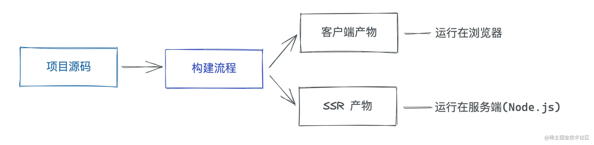

在早起的Web技术中，大家还是使用JSP这种古老的模版语法来编写前端的页面，然后直接将JSP文件放到服务端，在服务端填入数据并渲染出完整的页面内容，可以说那个时代的做法是天然的服务端渲染。但随着AJAX技术的成熟以及各种前端框架（如：vue、react）的兴起，前后端分离的开发模式逐渐成为常态，前端只负责页面UI以及逻辑的开发，而服务端只负责提供数据接口，这种开发方式下的页面渲染也叫`客户端渲染`(Client Side Render，简称CSR)。

但客户端渲染也存在着一定的问题，例如首屏加载比较慢、对SEO不太友好，因此SSR(Server SIde Render)即服务端渲染技术应运而生，它在保留CSR技术栈的同时，也能解决CSR的各种问题。

### SSR的基本概念

一般，SSR的HTML产物如下的结构：

```html
<!DOCTYPE html>
<html>
<head>
  <meta charset="utf-8" />
  <title></title>
  <link rel="stylesheet" href="xxx.css" />
</head>
<body>
  <!-- 一开始没有页面内容 -->
  <div id="root"></div>
  <!-- 通过 JS 执行来渲染页面 -->
  <script src="xxx.chunk.js"></script>
</body>
</html>

```

当浏览器拿到如上HTML内容之后，其实并不能渲染完整的页面内容，因此此时的body中基本只有一个空的div节点，并没有填入真正的页面内容。而接下来浏览器开始下载并执行JS代码，经历框架初始化、数据请求、DOM的插入等操作之后才能渲染出完整的页面。也就是说，在CSR中完整的页面内容本质上通过JS代码执行之后才能够渲染。这主要会导致两个方面的问题：

- 首屏加载速度比较慢：首屏加载需要依赖JS的执行，下载和执行JS都可能是非常耗时的操作，尤其是在一些网络不佳的场景下，或者性能敏感的低端机下。

- 对SEO（搜索引擎优化）不友好。页面HTML没有具体的页面内容，导致搜索引擎爬虫无法获取关键词信息，导致网站排名收到影响。

### SSR是如何解决这些问题的？

在SSR的场景下，服务端生成好完整的HTML内容，直接返回给浏览器，浏览器能够根据HTML渲染出完整的首屏内容，而不需要依赖JS的加载，这样一方面能够降低首屏渲染的时间，另一方面也能将完整的页面内容展现给搜索引擎的爬虫，利于SEO。

SSR中只能生成页面的内容和结构，并不能完成事件绑定，因此需要在浏览器中执行CSR的JS脚本，完成事件绑定，让页面拥有交互的能力，这个过程被称作`hydrate`（注水、激活）。同时，像这样服务端渲染 + 客户端hydrate的应用也被称为`同构应用`。

### SSR生命周期分析

前端的代码经过编译后放到服务端中能够正常执行，其次在服务端渲染前端组件，生成并组装应用的HTML。这就涉及到SSR应用的两大生命周期:`构建时`和`运行时`。

我们先看看`构建时`需要做哪些事情：

- 解决模块加载问题。在原有的构建过程之外，需要加入`SSR构建`的过程，具体来说，我们需要生成另外一份`CommonJS`格式的产物，使之能在NodeJS正常加载。当然，随着NodeJS本身对ESM的支持越来越成熟，我们也可以复用前端ESM格式的代码，Vite在开发阶段进行SSR构建也是这样的思路。




- 移除样式代码的引入，直接引入一行CSS在服务端其实是无法执行的，因为NodeJS并不能解析CSS的内容，`CSS Modules`的情况除外。

```ts
import styles from './index.module.css'

// 这里的 styles 是一个对象，如{ "container": "xxx" }，而不是 CSS 代码
console.log(styles)
```

- 依赖外部化(external)，对于某些第三方依赖我们并不需要使用构建后的版本，而是直接从`node_modules`中读取，比如`react-dom`这样在SSR构建的过程将不会构建这些依赖，从而极大程度上加速SSR的构建。

对于SSR的运行时，一般可以拆分为比较固定的生命周期阶段，简单来说可以整理为一下几个核心的阶段：


- 加载SSR入口模块。在这个阶段，我们需要确定SSR构建产物的入口，即组件的入口在哪里，并加载对应的模块。

- 进行数据预取。这个时候Node测会通过查询数据库或者网络请求来获取应用所需要的数据。

- 渲染组件。这个阶段为SSR的核心，主要将第一步中加载的组件渲染成HTML字符串或Stream流。

HTML拼接。在组件渲染完成之后，我们需要拼接完整的HTML字符串，并将其作为响应返回给浏览器。

从上面的分析得知，SSR其实是`构建`和`运行`时互相配合才能实现的，也就是说，仅靠构建工具是不够的，写一个Vite插件严格意义上无法实现SSR的能力，我们需要对Vite的构建流程做一些整体的调整，并且加入一些服务端运行时的逻辑才能实现。

### 工程化问题

1. 路由管理

在SPA场景下，对于不同的前端框架，一般会有不同的路由管理方案，如Vue中的`vue-router`、`react-router`。不过归根结底，路由方案在SSR过程中所完成的功能都是差不多的：

    - 告诉框架现在渲染哪个路由。在Vue中我们可以通过`router.push`确定即将渲染的路由，React中则通过`StaticRouter`配合`location`参数来完成。

    - 设置`base`前缀。规定路径的前缀，如`vue-router`中base参数、react-router中`StaticRouter`组件的`basename`。

2. 全局状态管理

对于全局的状态管理而言，对于不同的框架也有不同的生态和方案，比如Vue中中的vuex、pinia，React中的Redux、Recoil。各个状态管理工具的用法并不是本文并不是本文的重点，接入SSR的思路也比较简单，在`预取数据`阶段初始化服务端的`store`，将异步获取的数据存入`store`中，然后在`拼接HTML`阶段将数据从store中取出数据script标签中，最后在客户端hydrate的时候通过window即可访问到预取数据。

> 需要注意的服务端处理许多不同的请求，对于每个请求都需要分别初始化store，即一个请求一个store，不然会造成全局状态污染问题。

3. CSR降级

在某些比较低端的情况下，我们需要降级到CSR，也就是客户端渲染。一般而言包含如下降级场景：

    - 服务端预取数据失败，需要降级到客户端获取数据。

    - 服务端出现异常，需要返回兜底的CSR模版，完全降级为CSR。

    - 本地开发调试，有时需要跳过SSR，仅进行CSR。

4. 浏览器 API 兼容

由于NodeJS中不能使用浏览器里面诸如`window`、`document`之类的API，因此一旦在服务端执行这样的API会报not defined 的问题。

我们可以通过`import.meta.env.SSR`这个Vite内置的环境变量来判断是否处于SSR环境，以此来规避业务代码在服务端出现浏览器的API：

```ts
if (import.meta.env.SSR) {
  // 服务端执行的逻辑
} else {
  // 在此可以访问浏览器的 API
}
```

我们也可以通过polyfill的方式，在Node中注入浏览器的API，使这些API能够正常运行起来，比如比较成熟的库`jsdom`。

